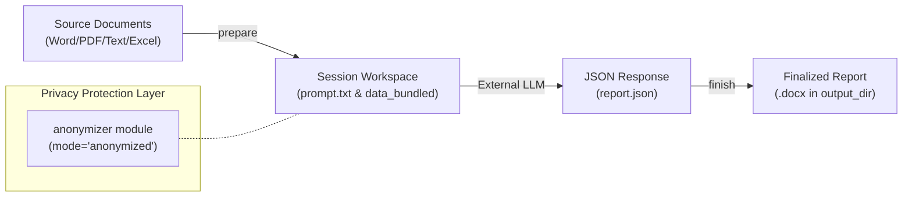

# report-forge




Language: [English](README.md) | [Deutsch](README_de.md)


> [!NOTE]
> This repository is optimized for AI agents and automated workflows. Machine-readable specifications and integration notes can be found in [`llms.txt`](llms.txt) and [`SKILL.md`](SKILL.md).

Domain-neutral core engine for schema-bound, anonymizable report generation pipelines: extract source documents → build LLM prompt bound to a JSON schema → populate Word (`.docx`) template with structured LLM responses. Privacy modes switchable between `mode="anonymized"` and `mode="plain"`.

---

## 🏗️ System Architecture



---

## ⚡ Feature Overview

| Feature | Description |
|---|---|
| **Architecture** | 3-phase pipeline (`prepare` → LLM → `finish`) |
| **Privacy & Security** | Fail-closed anonymization (`mode="anonymized"`) via `anonymizer` module (≥0.2.5) or plain-text (`mode="plain"`) |
| **Templates** | Word (`.docx`) template engine with `{{PLACEHOLDERS}}`, dynamic table rows, and checkbox toggling |
| **Automation** | Idempotent batch processor (`process-inbox`) for scheduled background execution |
| **Output & Storage** | Local-first publishing to designated `output_dir` with automatic timestamp collision protection |

---

## 📦 Installation

```bash
pip install .
pip install ".[formats]"  # optional: PDF/Excel/MSG-Extraktion
```
The canonical runtime versions and optional format extras are declared in
`pyproject.toml`; `requirements.txt` mirrors the two runtime lower bounds for
legacy callers. Optional anonymization still requires the separately installed
`anonymizer` module >=0.2.5.

---

## 🚀 Quick Start (mode="plain", unencrypted)

```python
from report_forge.workflow import ReportWorkflow

workflow = ReportWorkflow()

# Phase 1: Read source documents and construct LLM prompt
prepared = workflow.prepare(
    source_folder="source_docs/",
    work_root="sessions/",
    mode="plain",
)
# -> prepared.prompt_path contains the generated LLM prompt

# Phase 2: Execute external LLM (outside module boundary)
#          Save JSON output to prepared.session_dir / "data_bundled" / "report.json"

# Phase 3: Validate JSON response, populate Word template, and finalize report
finished = workflow.finish(
    session_dir=prepared.session_dir,
    llm_json_path=prepared.session_dir / "data_bundled" / "report.json",
    output_folder="output/final_report.docx",
)
```

> **Anonymized Mode (`mode="anonymized"`, Default):**
> When using `prepare()`, `real_name`, `birth_date`, and `password` are required arguments. For `finish()`, `password` is required. The `anonymizer` module (>=0.2.5) must be present in the Python environment (see [`SKILL.md`](SKILL.md)).

---

## 📥 Batch Inbox (`inbox_dir`) & Publishing (`output_dir`)

Optional key configurations in `config.json` or `config.local.json`:
- **`output_dir`**: Automatically copies finalized reports to a central distribution directory.
- **`inbox_dir`**: Incoming pickup directory for the automated batch runner `process-inbox`.

```bash
python -m report_forge process-inbox --work sessions/ --mode plain --dry-run
```

### Non-interactive anonymized CLI

Interactive runs keep hidden `getpass` prompts. In CI, Git Bash, or a pipe, set
`REPORT_FORGE_REAL_NAME`, `REPORT_FORGE_BIRTH_DATE`, and `REPORT_FORGE_PASSWORD`
for `prepare`; use `REPORT_FORGE_PASSWORD` for anonymized `finish` and
`REPORT_FORGE_INBOX_PASSWORD` for `process-inbox`. The `--*-env` options accept
variable names only, never secret values. Missing secrets without a TTY return
exit 2 instead of blocking, and secret values are never printed.

---

## 🧪 Testing

```bash
PYTHONIOENCODING=utf-8 python -m pytest tests/ -q
```

---

## 📄 License

MIT License, see [LICENSE](LICENSE).

